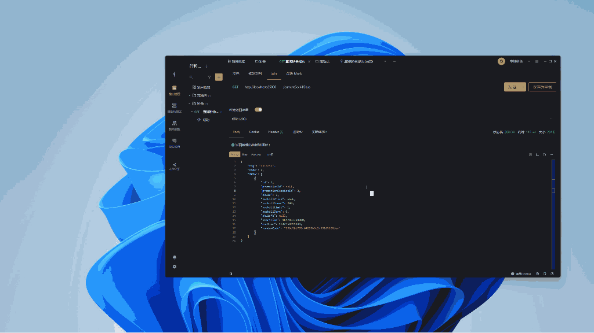
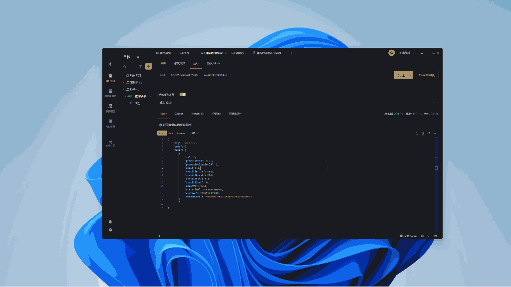

# 窗口管理

> **<kbd>A</kbd>  禅模式（单手操作原理）**
>
> - 进入：组合键按下后，即可松手，键盘进入 1.5 秒的监听状态，根据用户第二个按键，立即做出一次响应动作。
> - 退出：等待超时，会退出状态，或者按下 <kbd>Esc</kbd> 键，主动退出禅模式。
> 
> 注意： 如果遇到状态栏菜单，快速弹出作为收尾动作，这是正常现象，因为用来解除 <kbd>Win</kbd> 键的锁死，避免卡键的副作用。

**<kbd>A</kbd> 系列的组合键，专门集成窗口管理和鼠标控制的功能**

### 📺 窗口移动

按下 <kbd>Caps</kbd> + <kbd>Alt</kbd> + <kbd>A</kbd> （可以松手了）开启禅模式：

此时轻敲 <kbd>第二个键</kbd>，移动窗口坐标位置。

- <kbd>H</kbd> <kbd>J</kbd> <kbd>K</kbd> <kbd>L</kbd> 控制左下上右的移动方向（Vim 风格）
- <kbd>␣</kbd> 窗口回到屏幕中央

### 📺 窗口定型

按下 <kbd>Caps</kbd> + <kbd>Ctrl</kbd> + <kbd>A</kbd> （可以松手了）开启禅模式：

此时轻敲 <kbd>第二个键</kbd>，使得窗口占据屏幕部分区域。

- <kbd>H</kbd> <kbd>J</kbd> <kbd>K</kbd> <kbd>L</kbd> 上下左右，即 Vim 风格
- <kbd>[</kbd> <kbd>]</kbd> 偏左 / 右（2:1）
- <kbd>I</kbd> <kbd>O</kbd> 偏左 / 右（1:1）
- <kbd>␣</kbd> 中央（1:1:1）
- <kbd>N</kbd> 正中央
- <kbd>M</kbd> <kbd>,</kbd> 窗口最大/小化
- <kbd>.</kbd> 窗口大小回到上一个状态
